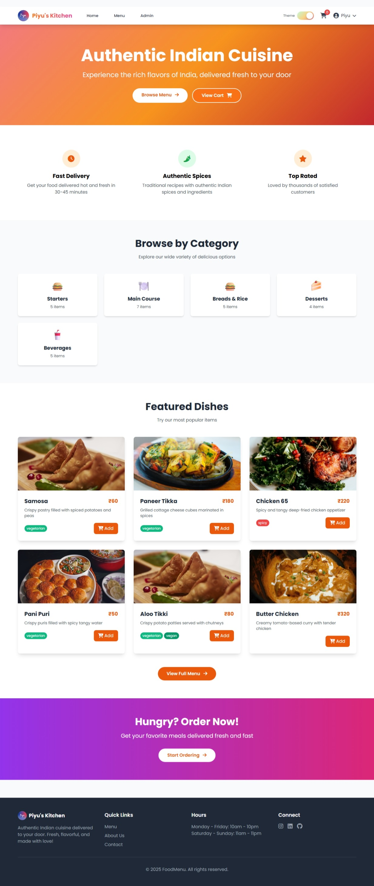
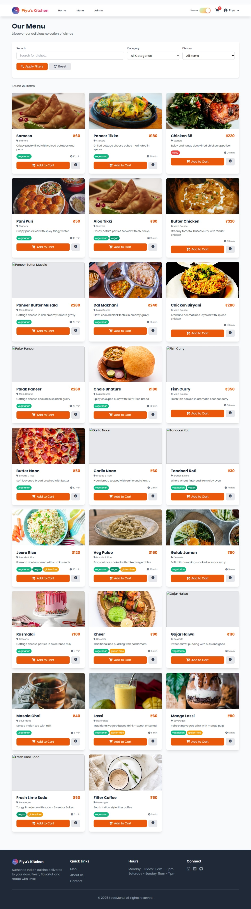
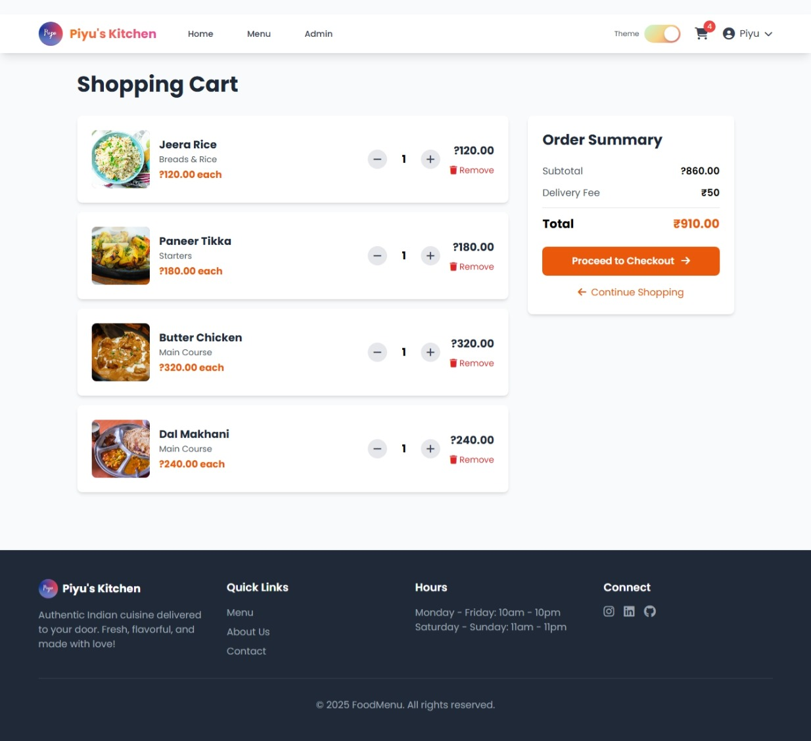
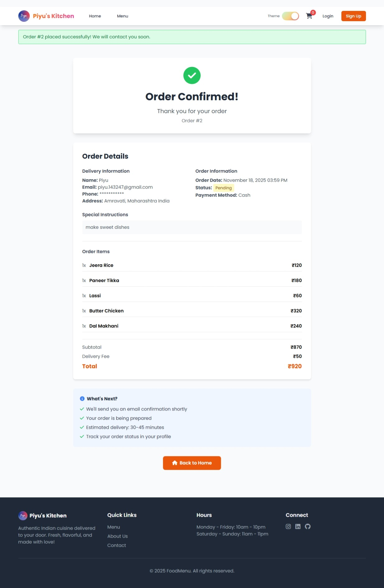
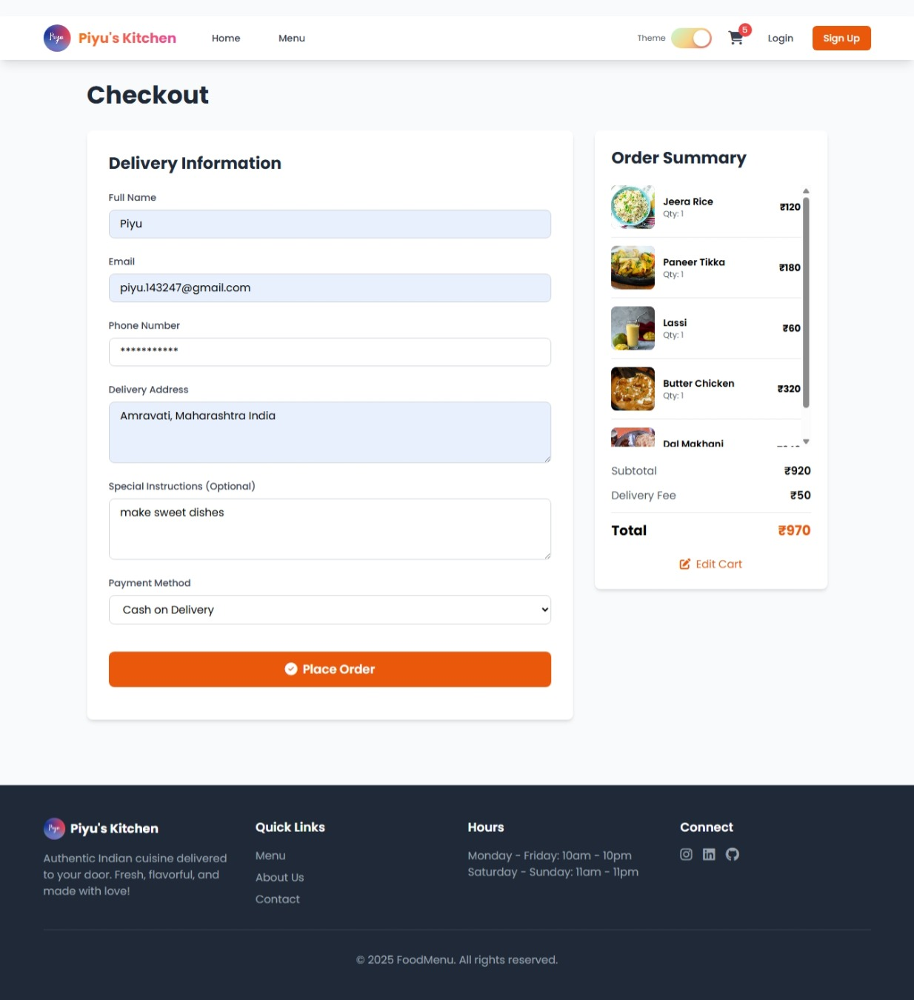

# Food Menu Website

A modern, fully functional food ordering website built with Flask, Tailwind CSS, and Alpine.js.

## Features

- 🍕 Browse menu items by category
- 🔍 Search and filter menu items
- 🛒 Shopping cart with real-time updates
- 👤 User authentication and registration
- 📦 Order management and history
- 🔐 Admin dashboard for menu management
- 📱 Fully responsive design
- 🎨 Modern UI/UX with Tailwind CSS

## Tech Stack

- **Backend:** Flask 3.0, SQLAlchemy, Flask-Login
- **Frontend:** HTML5, Tailwind CSS, Alpine.js
- **Database:** SQLite (development)
- **Authentication:** Flask-Login with password hashing

## Screenshots

### Admin Dashboard


### Home


### My Profile


### Screenshot 1


### Screenshot 2


### Screenshot 3


### Screenshot 4


### Shopping Cart


## Installation

1. **Clone the repository**
   ```bash
   cd c:\Users\Piyu\Downloads\Expirement
   ```

2. **Create virtual environment**
   ```powershell
   python -m venv venv
   .\venv\Scripts\activate
   ```

3. **Install dependencies**
   ```powershell
   pip install -r requirements.txt
   ```

4. **Initialize database**
   ```powershell
   flask db init
   flask db migrate -m "Initial migration"
   flask db upgrade
   ```

5. **Seed sample data**
   ```powershell
   flask seed-data
   flask create-admin
   ```

6. **Run the application**
   ```powershell
   python run.py
   ```

7. **Open in browser**
   ```
   http://localhost:5000
   ```

## Default Admin Credentials

- **Username:** admin
- **Password:** admin123

## Project Structure

```
food-menu-website/
├── app/
│   ├── __init__.py           # Flask app factory
│   ├── models.py             # Database models
│   ├── forms.py              # WTForms forms
│   ├── auth/                 # Authentication routes
│   ├── main/                 # Main public routes
│   ├── cart/                 # Cart and checkout
│   ├── admin/                # Admin dashboard
│   ├── static/               # CSS, JS, images
│   └── templates/            # Jinja2 templates
├── migrations/               # Database migrations
├── instance/                 # Instance-specific files
├── run.py                    # Application entry point
└── requirements.txt          # Python dependencies
```

## Usage

### For Customers
1. Browse the menu on the homepage
2. Filter by category or search for items
3. Add items to cart
4. Register/login to place orders
5. Complete checkout with delivery details
6. View order history in your profile

### For Admins
1. Login with admin credentials
2. Access admin dashboard at `/admin`
3. Add, edit, or delete menu items
4. Manage categories
5. View and update order status
6. Upload food images

## Development

- Run in debug mode: `python run.py`
- Create migrations: `flask db migrate -m "description"`
- Apply migrations: `flask db upgrade`
- Access Flask shell: `flask shell`

## Security Features

- Password hashing with Werkzeug
- CSRF protection with Flask-WTF
- Session-based authentication
- Secure file uploads
- SQL injection prevention with SQLAlchemy ORM

## License

MIT License - feel free to use for personal or commercial projects.

## Author

Built with ❤️ using Flask and modern web technologies
